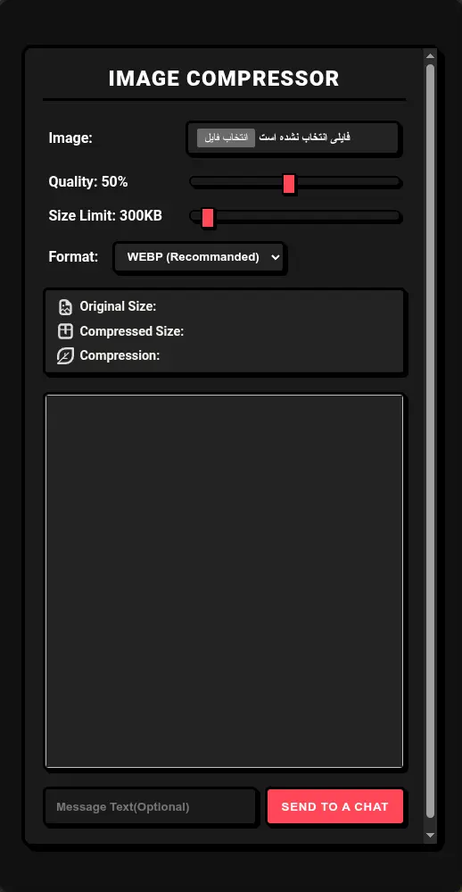

  

<h1 align="center">Image Compressor</h1>

**Image Compressor** is a [webxdc](https://webxdc.org) app that runs inside **Delta Chat**, shrinking images right on your device before you share them:

- 🖼️ **Image** — Pick any image from your device and get a compressed copy
- 🎚️ **Quality** — Fine-tune the compression quality from 5% to 100%
- 📦 **Size Limit** — Target a maximum file size (from 50 KB up to 5 MB, default 300 KB); the app automatically squeezes the image down to your chosen limit
- 🎨 **Format** — Output as WEBP (recommended), JPEG, or PNG
- 🔒 **Client-side compression** — Images never leave your device; everything runs in your browser with no server
- 👁️ **Live preview & stats** — See the compressed image along with original size, compressed size, and compression ratio
- ⏳ **Progress indicator** — Shows compression progress while processing
- 💬 **Send to a chat** — The compressed image is sent as a webxdc update, with an optional accompanying message

## Screenshot

## Development

The app is plain HTML/CSS/JS with no build step. Open `index.html` directly in a browser to develop — outside Delta Chat the "Send to a chat" button is disabled and shows "You aren't in WEBXDC", since `webxdc.js` is injected by the Delta Chat runtime.

To test real chat integration, package the folder as a `.zip` file, rename it to `.xdc` and share it in a DeltaChat chat. For convenience, run `temp/make-xdc.sh` to produce a ready-to-share `temp/app.xdc`.
